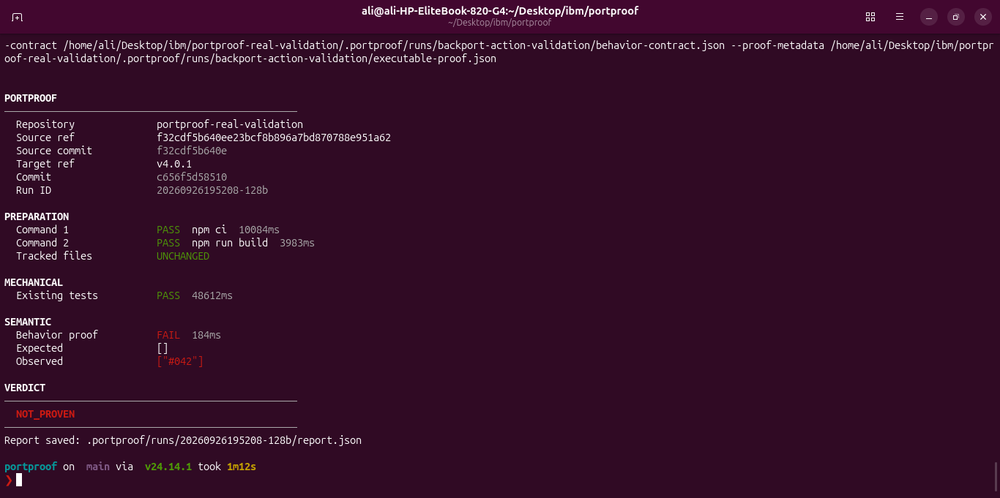
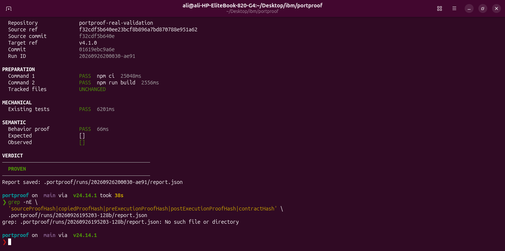
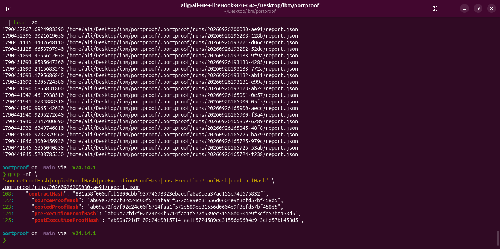

# Real-world validation: `korthout/backport-action`

This validation exercised PortProof against the public TypeScript repository [`korthout/backport-action`](https://github.com/korthout/backport-action). It is independent from PortProof's prepared `semantic-backport` fixture.

PortProof is not affiliated with the upstream project. This work reproduced a documented historical fix to validate PortProof's workflow; it does not claim to have discovered a previously unknown upstream bug.

## Why this repository

`backport-action` provides a useful independent case because it is a real, versioned TypeScript project with normal dependency installation, compilation, and tests. Its historical versions expose a behavioral distinction that can be observed through a public function while the repository's own test suite remains green. That makes it suitable for testing PortProof's central claim without relying on the prepared fixture.

## Provenance

| Item | Value |
|---|---|
| Repository | `korthout/backport-action` |
| Source fix | `f32cdf5b640ee23bcf8b896a7bd870788e951a62` |
| Target 1 | `v4.0.1` → `c656f5d5851037b2b38fb5db2691a03fa229e3b2` |
| Target 2 | `v4.1.0` → `01619ebc9a6e3f6820274221b9956b3e7365000a` |

The contracted behavior was:

```text
getMentionedIssueRefs(' #042 ')  →  []
```

The leading-zero input matters: the observable behavior must not interpret `#042` as a valid mentioned issue reference.

## Bob evidence workflow

The Bob SourceAgent and TargetAgent were isolated from one another during investigation. SourceAgent reconstructed the intended behavior from the source fix. TargetAgent independently inspected each historical target rather than assuming the source architecture existed there.

Their structured outputs were handed to BehaviorMapper, which produced the `BehaviorContract`. ProofAdapter then generated a new executable proof against the declared public boundary. The proof was not copied from an upstream regression test, and no upstream regression test for this leading-zero behavior was reused.

Bob produced evidence; it did not assign either verdict.

## Deterministic execution

PortProof performed the following independently for both targets:

1. Resolved the source and target refs to commits.
2. Created a fresh isolated Git checkout of the selected target.
3. Ran the user-owned preparation commands: `npm ci`, then `npm run build`.
4. Confirmed preparation did not modify tracked files.
5. Validated the generated proof's static public-boundary import after compilation.
6. Ran the repository's normal tests.
7. Copied and executed the exact frozen proof bytes.
8. Parsed the observation and assigned the deterministic verdict.

Normal repository tests passed on both versions. Preparation also passed on both versions.

## Results

| Target | Preparation | Existing tests | Expected | Observed | Verdict |
|---|---:|---:|---|---|---|
| `v4.0.1` | PASS | PASS | `[]` | `["#042"]` | `NOT_PROVEN` |
| `v4.1.0` | PASS | PASS | `[]` | `[]` | `PROVEN` |

The result demonstrates the intended distinction: passing repository tests did not by itself establish the behavior on `v4.0.1`, while the independently generated public-boundary proof did establish it on `v4.1.0`.

<p>
  
  
</p>

## Frozen evidence integrity

Both versions used the exact same Bob-generated evidence:

| Artifact | SHA-256 |
|---|---|
| Executable proof | `ab09a72fd7f02c24c00f5714faa1f572d589ec31556d0604e9f3cfd57bf458d5` |
| BehaviorContract | `831a58f000dfeb1800cbbf93774593823ebaedfa6a0bea37ad155c74d675832f` |

For both runs, the source, copied, pre-execution, and post-execution proof hashes matched. PortProof did not rewrite the proof import, assertion, expected value, or source bytes between targets.

<p align="center">
  
</p>

## Scope of the result

This validation shows that PortProof can prepare and verify a real TypeScript repository outside its bundled fixture, preserve source/target provenance, and distinguish two historical versions using one immutable semantic proof. It proves only the stated `BehaviorContract` through the declared public boundary; it is not a claim of universal correctness for either release.
